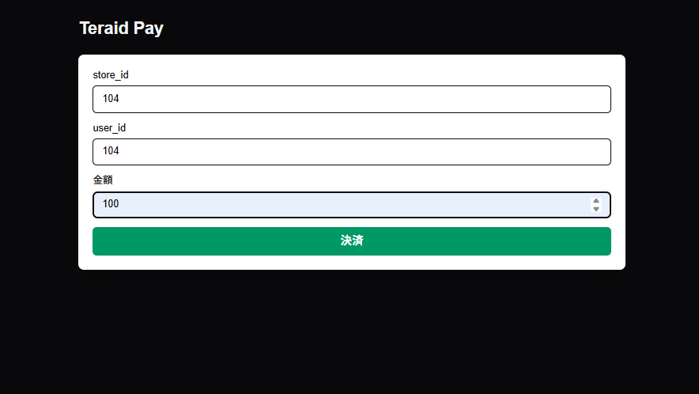
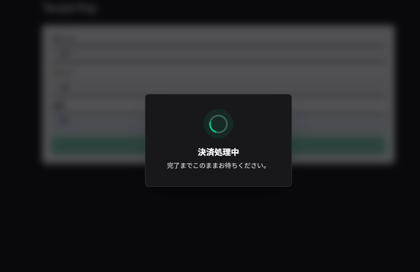
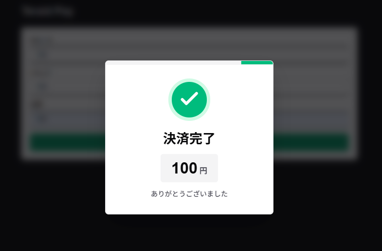
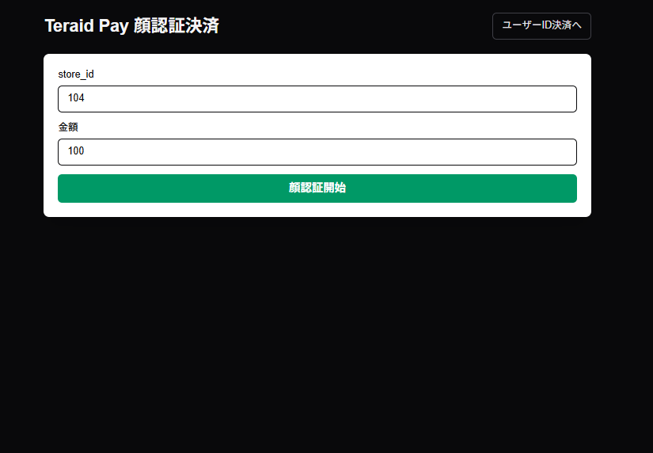
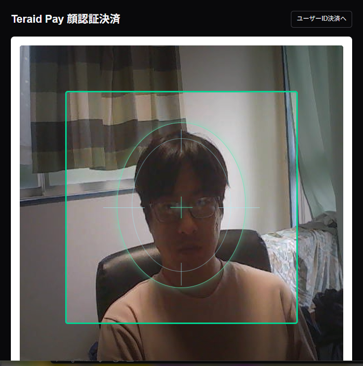
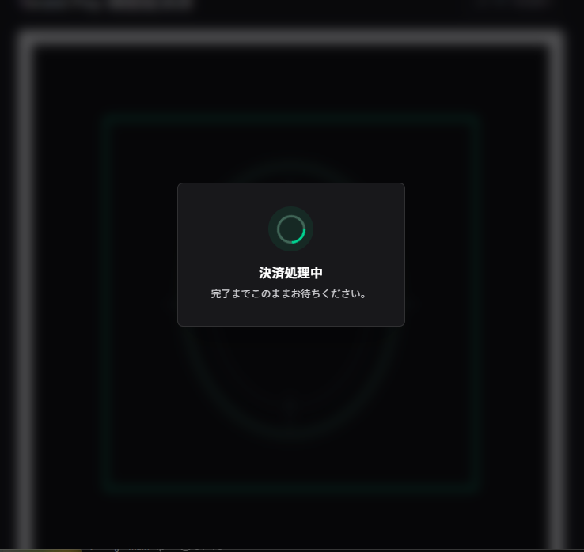
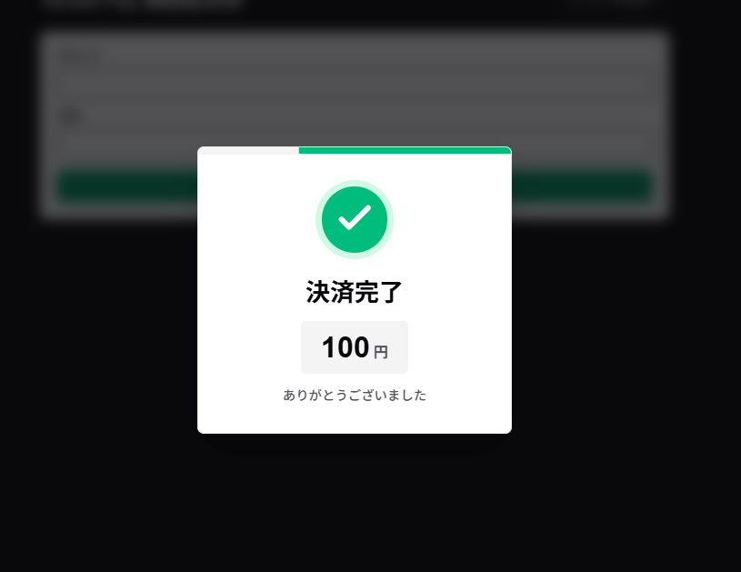

# Teraid Pay Web

Teraid Pay の決済リクエストを作成し、決済実行後に検証結果をポーリングして表示する Next.js アプリケーションです。

## 技術スタック

- Next.js 16.2.4
- React 19.2.4
- TypeScript 5
- Tailwind CSS 4
- ESLint 9

このプロジェクトは Next.js App Router 構成です。画面は `app/page.tsx` を起点に実装されています。

## 機能仕様

トップページ `/` に決済フォームを表示します。

フォーム項目:

- `store_id`: 店舗 ID。数値、必須、最小値 1。
- `user_id`: ユーザー ID。数値、必須、最小値 1。
- `amount`: 決済金額。数値、必須、最小値 1。

プロトタイプ用の制約として、`store_id` と `user_id` は `104` のみ利用できます。その他の ID は利用できません。

送信時の処理:

1. `POST /payment/request` で決済リクエストを作成します。
2. 作成された `payment_request_id` を使って `POST /payment/request/{payment_request_id}/execute` を呼び出します。
3. `POST /payment/request/{payment_request_id}/verify` を 3 秒間隔で呼び出し、決済ステータスを確認します。
4. 終了ステータスになるまで処理中オーバーレイを表示します。
5. 結果に応じて成功または失敗ダイアログを表示します。

終了ステータス:

- `paid`
- `tx_failed`
- `verify_failed`
- `canceled`
- `error`

成功条件:

- `verify` の結果が `paid` の場合、成功ダイアログを表示します。

失敗条件:

- `paid` 以外の終了ステータスの場合、失敗ダイアログを表示します。
- API エラーまたは通信エラーが発生した場合、失敗ダイアログを表示します。

## API 仕様

フロントエンドは `NEXT_PUBLIC_TERAID_PAY_API` で指定した Teraid Pay API に接続します。未設定の場合は `http://localhost:8005` を使用します。

TERAID_PAY_API のソースコードは [terao06/teraid-pay-api](https://github.com/terao06/teraid-pay-api) にあります。

OpenAPI 定義は [docs/swagger.yaml](docs/swagger.yaml) にあります。

関連する画面のソースコード:

- store のウォレットを設定する画面: [terao06/teraid-pay-admin](https://github.com/terao06/teraid-pay-admin)
- user のウォレットを設定する画面: [terao06/teraid-pay-user](https://github.com/terao06/teraid-pay-user)

プロトタイプ用の制約として、`store_id` と `user_id` は `104` のみ設定されています。その他の ID は利用できません。

### `POST /payment/request`

決済リクエストを作成します。

リクエスト例:

```json
{
  "store_id": 104,
  "user_id": 104,
  "amount": 1500
}
```

レスポンスの `data` には主に以下が含まれます。

- `payment_request_id`
- `from_wallet_address`
- `to_wallet_address`
- `amount`
- `chain_id`

### `POST /payment/request/{payment_request_id}/execute`

作成済みの決済リクエストを実行します。

レスポンスの `data` には主に以下が含まれます。

- `payment_request_id`
- `transaction_hash`

### `POST /payment/request/{payment_request_id}/verify`

決済トランザクションを検証し、決済ステータスを返します。

ステータス:

- `requested`
- `submitted`
- `confirming`
- `paid`
- `tx_failed`
- `verify_failed`
- `canceled`
- `error`

## 環境変数

`.env.development` に以下の値が定義されています。

| 変数名 | 用途 |
| --- | --- |
| `NEXT_PUBLIC_TERAID_PAY_API` | Teraid Pay API のベース URL。未設定時は `http://localhost:8005`。 |
| `NEXT_PUBLIC_FACE_PAYMENT_REQUIRED_VISIBLE_MS` | 顔認証決済で顔が映り続ける必要がある時間。ミリ秒指定。未設定時は `3000`。 |
| `NEXT_PUBLIC_WALLET_CONNECT_PROJECT_ID` | WalletConnect の Project ID。現在のフロント実装では未使用。 |
| `NEXT_PUBLIC_RPC_URL_ETHEREUM_MAINNET` | Ethereum mainnet RPC URL。現在のフロント実装では未使用。 |
| `NEXT_PUBLIC_RPC_URL_ETHEREUM_SEPOLIA` | Ethereum Sepolia RPC URL。現在のフロント実装では未使用。 |
| `NEXT_PUBLIC_RPC_URL_POLYGON_MAINNET` | Polygon mainnet RPC URL。現在のフロント実装では未使用。 |
| `NEXT_PUBLIC_RPC_URL_POLYGON_AMOY` | Polygon Amoy RPC URL。現在のフロント実装では未使用。 |
| `NEXT_PUBLIC_JPYC_TOKEN_ADDRESS_ETHEREUM_SEPOLIA` | Ethereum Sepolia 上の JPYC トークンアドレス。現在のフロント実装では未使用。 |

## セットアップ

依存関係をインストールします。

```bash
npm install
```

開発サーバーを起動します。

```bash
npm run dev
```

ブラウザで `http://localhost:3000` を開きます。

API は別途 `NEXT_PUBLIC_TERAID_PAY_API` の URL で起動している必要があります。デフォルトでは `http://localhost:8005` です。

## スクリプト

| コマンド | 内容 |
| --- | --- |
| `npm run dev` | Next.js 開発サーバーを起動します。 |
| `npm run build` | 本番ビルドを作成します。 |
| `npm run start` | 本番ビルドを起動します。 |
| `npm run lint` | ESLint を実行します。 |

## ディレクトリ構成

```text
app/
  components/
    PaymentForm.tsx          決済フォーム
    PaymentResultDialog.tsx  決済結果ダイアログ
    ProcessingOverlay.tsx    処理中オーバーレイ
  types/
    payment.ts               決済 API の型定義
  globals.css                グローバル CSS
  layout.tsx                 ルートレイアウト
  page.tsx                   トップページと決済フロー
docs/
  swagger.yaml               Teraid Pay API の OpenAPI 定義
public/
  *.svg                      Next.js 初期生成の静的アセット
```

## 画面イメージ
### ユーザーIDベース決済
#### 決済初期画面


#### 決済中ダイアログ


#### 決済完了ダイアログ


### 顔認証ベース決済
#### 決済初期画面


#### 顔認証画面


#### 決済中ダイアログ


#### 決済完了ダイアログ
